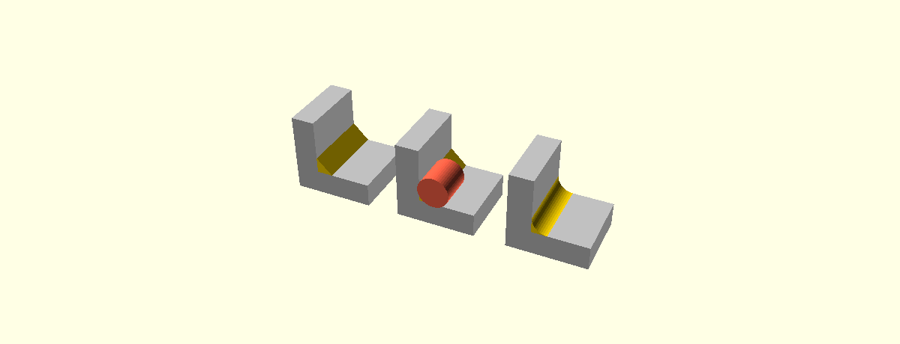

# Fillets, rounds, chamfers and bevels

*Draft of the reference page. This moves into `doc/` before the PR merges; the
directory it currently sits in does not survive the merge.*

OpenSCAD can round or cut back the edges of a solid it is given. The operators
read the mesh and find the edges themselves, so they work on anything that is a
solid — a CSG tree, an imported STL, the output of `hull()` or `minkowski()`.

**These modules are experimental.** They are only available with
`--enable=fillet` on the command line, or with `fillet` ticked under Preferences
→ Features in the GUI. Without it a call to any of them is an unknown module.
The limitations at the foot of this page are the reason, and they are a
condition of use rather than a surprise.

There are five modules. One is sugar over the other four.

| Module | Shape of the blend | Sign of the edge | How it is used |
|---|---|---|---|
| `fillet_tool(r)` | round | concave (inner) | `union()` it into the model |
| `chamfer_tool(t)` | flat | concave (inner) | `union()` it into the model |
| `round_tool(r)` | round | convex (outer) | `difference()` it from the model |
| `bevel_tool(t)` | flat | convex (outer) | `difference()` it from the model |
| `fillet(r)` | round | both | applies both, in one call |


*Back row: each tool solid on its own. Front row: the same tool composed with the
model it was built from.*

The four `*_tool` modules each return a **tool solid** — the material a blend
adds or removes — which you compose yourself. That is what makes them
composable: any arrangement you can write in OpenSCAD is available to you.

### What a tool solid is

Take an L with one straight inside corner. The chamfer along it is a prism laid
down the corner, reaching `t` along each wall. The fillet is that same prism with
a cylinder of radius `r` taken out of it — the path a ball of that radius takes
rolling down the corner, touching both walls the whole way.



*Left to right: `chamfer_tool(t = 4)` in gold on the model in grey; the same
prism with the cylinder that comes out of it drawn in red; `fillet_tool(r = 4)`;
and the cross-section lying flat. The section is a pentagon because every cell
stands a hair past both walls — a tool has to cross the surface it cuts rather
than rest on it — and that hair is drawn far larger than life, being 0.004 mm at
this size.*

The rest is that idea generalised: the corner bends, the walls curve, the angle
between them changes along the way, and where several corners meet at a point the
ball has nowhere to roll and simply sits, touching every wall at once.

## fillet()

```openscad
fillet(r = 2) my_model();
```

`fillet()` is the whole thing in one call: it unions the fillet tool into the
model, and then rounds the solid that produced.

```openscad
module fillet(r = 2, inner = true, outer = true, min_angle = undef) {
    module blended() {
        union() {
            children();
            if (inner) fillet_tool(r = r, min_angle = min_angle) children();
        }
    }
    difference() {
        blended() children();
        if (outer) round_tool(r = r, min_angle = min_angle) blended() children();
    }
}
```

The node is exactly that. **"Then" is the load-bearing word**: the round pass is
measured against the solid the fillet pass left, not against your model. Where an
inner bead runs out onto a face it leaves the end of its cross-section standing
in that face, and that outline gets rounded along with everything else.

`blended() children()` at both call sites is the trick that makes this writable
in OpenSCAD — inside `blended()`, `children()` means *its* children, so the model
has to be handed in at each call.


*Left to right: the model untouched, `fillet(r = 2)`, `inner = false`,
`outer = false`.*

| Parameter | Default | Meaning |
|---|---|---|
| `r` | — | blend radius |
| `inner` | `true` | build the concave half |
| `outer` | `true` | build the convex half |
| `min_angle` | 46 | the feature-angle threshold, in degrees |
| `disable_preview` | `true` | pass the child through unchanged under F5 |

### Preview

**Under F5, `fillet()` hands back its child untouched**, because the blends cost
a mesh analysis and two booleans on every keystroke. Press F6 to see them, or
pass `disable_preview = false`. One consequence worth knowing: a blend that adds
material into a clearance gap will not show that interference in preview.

The four `*_tool` modules always build, in preview and render alike — a tool that
vanished under one render mode would break every composition built out of it.

## The tool modules

```openscad
fillet_tool(r = 3)  target();     // or r =, t = interchangeably
chamfer_tool(t = 3) target();
round_tool(r = 3)   target();
bevel_tool(t = 3)   target();
```

`fillet_tool` and `round_tool` take a radius `r`; `chamfer_tool` and `bevel_tool`
take a setback `t`, the distance the flat cut reaches back along each face. Both
spellings are accepted by all four, so `fillet_tool(t = 3)` works and means the
same as `fillet_tool(r = 3)`.

All four also take `min_angle` and `debug`, below.

Child 0 is the target. Children 1 and later are **selection brushes**.

## Which edges get treated

An edge is treated when it turns by more than a threshold, and when its sign
matches the tool. Everything else is left alone.

**The threshold is a constant, 46°.** It is not derived from `$fn`, `$fa` or
`$fs`, and it is not measured off the mesh. A solid does not carry the settings
that made it — it may be a union of primitives built at different `$fn`, an
imported STL with no `$fn` at all, or a mesh that has been through `resize()` —
so the same shape must classify the same way however it arrived, and only a
constant can promise that. `$fn`, `$fa` and `$fs` still control the tessellation
of the blend surfaces the operators *build*; they are not inputs to the choice
of which edges to build on.

46° sits just above 45°, which is the facet angle of `cylinder($fn = 8)`, so an
octagonal prism's wall seams stay seams. Below that — a `$fn` of 7 or coarser,
whose facets turn by 51.4° — the wall seams are treated as features.

`debug = true` echoes what the classifier decided:

```
ECHO: round_tool: mesh 104 verts (104 merged), 204 tris, 2 surfaces; 306 edges
      (306 two-face, 0 non-manifold); feature edges 108 (concave 48, convex 60,
      60 same-surface); selects 60 convex edge(s) at 46.0 deg
```

### min_angle

`min_angle = <degrees>` replaces the 46° constant, and it is **the answer for a
crease shallower than that**. A constant threshold has to pick one number, and a
model with a genuine 30° corner — an oblique branch, a shallow chamfer already
cut, a swept form that meets its wall at a slant — will not have that corner
found by default. `min_angle = 25` finds it. This is what the parameter is for,
not a fine adjustment: it is an explicit statement about your model, where the
default is a statement about models in general.

It works in the other direction too. Raising `min_angle` above 46° drops shallow
creases you would rather leave alone, and lowering it below a curved surface's
facet angle deliberately treats every tessellation seam as a feature.


*Left: the default 46° threshold at `$fn = 24`, which rejects the cylinder's 15°
seams and rounds only the two rims. Right: `min_angle = 10`, below the seam
angle, so every vertical seam is now a feature and the post comes back fluted.*

## Selection brushes

Children 1 and later of a tool module are **selection brushes**: solids whose
volume says where the tool may act. They are unioned together, and a crease is
built where it lies inside that volume and left sharp where it does not.

A brush controls *extent along the edge* — where the blend starts and stops. The
blend is the full requested size wherever it is built, however narrow the brush
is.

Where a brush boundary crosses a crease, the blend is **cut square across**,
ending in a flat cap.


*A block with a blind bore, near half cut away. Left: no brush, so every convex
crease is rounded, the block's own twelve edges included. Right: a disc over the
mouth as child 1 of `round_tool`, so the mouth is rounded and the block stays
sharp. The bore floor is filleted in both — it is the model's only concave
crease, so it needs no brush.*

```openscad
difference() {
    union() {
        part();
        fillet_tool(r = 2) part();          // bore floor: no brush needed
    }
    round_tool(r = 2) {
        part();
        translate([20, 20, 14]) cylinder(r = 14, h = 8);   // brush
    }
}
```

Because the brushes are ordinary children, `union()`, `difference()` and
`intersection()` of them all work, and a brush can be any solid at all.

### One edge, or one corner


**Part of one edge** — a brush that stops short of both ends selects that one
crease and nothing else, and the blend ends in flat caps:

```openscad
round_tool(r = 3) {
    cube(20);
    translate([-4, -4, 4]) cube([8, 8, 12]);
}
```

**One whole edge, end to end** — this needs care. A brush long enough to reach
both ends also catches the start of the four edges meeting the one you want, and
those get rounded too. Keep it narrow — less than a radius out from the edge on
each side — and they drop out:

```openscad
round_tool(r = 3) {
    cube(20);
    translate([-1, -1, -1]) cube([2, 2, 22]);   // 1 mm each side of the edge
}
```

What matters is how far the brush reaches **from the edge**, and the limit is the
radius. The width decides which creases are taken, never what is built along
them.

**One corner** — a box around the vertex selects the three creases meeting there,
and the corner between the three blends is built as well:

```openscad
round_tool(r = 3) {
    cube(20);
    translate([-2, -2, 10]) cube([12, 12, 12]);
}
```

## When a size does not fit

A size is never silently reduced to make it fit. If a blend of the requested size
cannot be built along a crease, **that crease is dropped and a warning names
it**:

```
WARNING: fillet_tool: radius 2 does not fit the crease at [12, -12, 2] -
         another feature 1.69 away needs the same material. That crease is
         dropped; the size is never clamped to make it fit.
```

Two things are checked, per crease and along its length rather than only at its
ends:

- **Does the blend still meet the model?** Its contact points have to land on the
  faces it is meant to blend, not past their ends. A radius of 35 has nowhere to
  sit on a 30 mm face.
- **Is the material it needs its own?** If a second feature is closer than the
  blend reaches, the two are competing for the same material.

Other creases on the same model are unaffected — a model with one edge too tight
still gets every other edge blended.

## Re-filleting

Applying these operators to a model that has already been blended is **not
reliable**. A finished blend meets its wall tangentially, and any tessellation of
a tangential meeting produces slivers whose normals are numerical noise. Read
back in, those slivers classify as creases of both signs that the shape does not
actually have.

The angle threshold is the only protection, and `min_angle` is the override. If
you need to blend a model in stages, blend the *source* model with a larger set
of operations rather than re-reading a blended result.

## debug

`debug = true` on any of the four tool modules replaces the tool solid with a
diagnostic overlay: one coloured marker per edge, saying what the classifier
decided.

| Colour | Meaning |
|---|---|
| red | concave feature |
| green | convex feature |
| grey | rejected — turns less than the threshold |

Render it with F5. The overlay is a cloud of disjoint marker cubes rather than a
solid, so it is for looking at, not for building with.

## Limitations

- **One size per invocation.** A tool node carries a single size for everything
  it builds. Variable radius along an edge, and different radii meeting at a
  corner, are not expressible.
- **No runout.** A blend that stops partway along an edge stops square, not
  tapered.
- **Experimental.** The five modules require `--enable=fillet`, as the first
  paragraph of this page says.
- **A build without Manifold.** The tool solids are built through Manifold, so in
  a build configured without it the five modules are not registered at all and a
  call to one is an unknown-module error. The runtime `--backend=cgal` is a
  different thing and is fully supported: the node builds its tool through
  Manifold internally and hands the result to whichever backend is rendering.
- **The size check refuses conservatively.** Some creases that could
  geometrically carry the blend are dropped with the warning above. A refusal is
  the safe error; a blend that produces a self-intersecting solid is not.
- **A crease shallower than 46° is not blended unless `min_angle` says so.** See
  min_angle above. This is the price of a threshold that does not read the mesh.
- **Re-filleting an already-blended model is not reliable.** See above.
