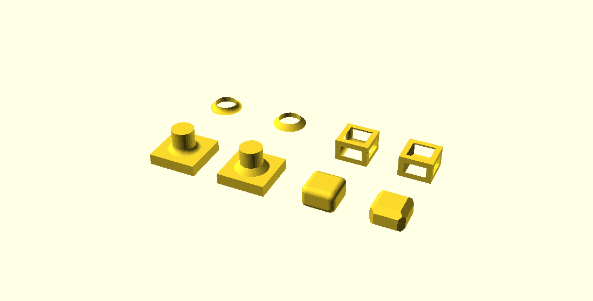
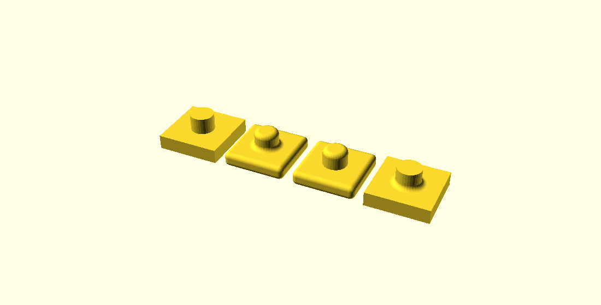
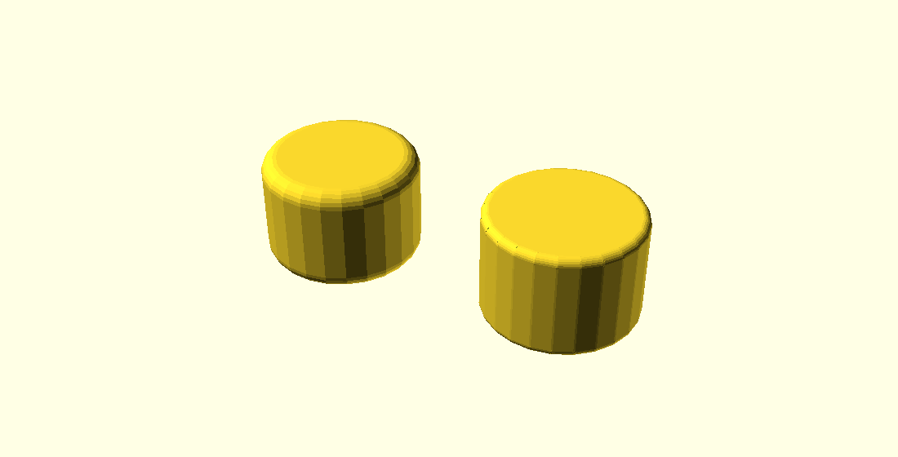
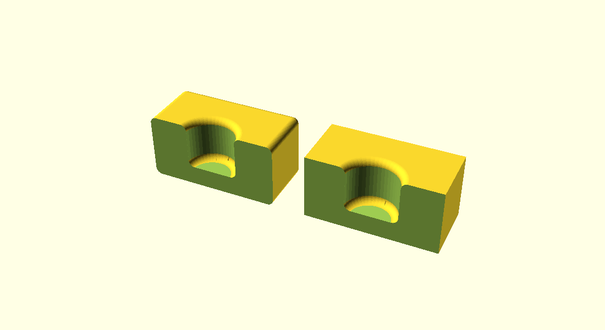

# Fillets, rounds, chamfers and bevels

*Draft of the reference page. This moves into `doc/` before the PR merges; the
directory it currently sits in does not survive the merge.*

OpenSCAD can round or cut back the edges of a solid it is given, without being
told where those edges are. The operators find the edges themselves by reading
the mesh, so they work on anything — a CSG tree, an imported STL, the output of
`hull()` or `minkowski()`.

There are five modules. Four build tools you compose yourself; the fifth runs
two of them for you, in the order that gets the corners between them right.

| Module | Shape of the blend | Sign of the edge | How it is used |
|---|---|---|---|
| `fillet_tool(r)` | round | concave (inner) | `union()` it into the model |
| `chamfer_tool(t)` | flat | concave (inner) | `union()` it into the model |
| `round_tool(r)` | round | convex (outer) | `difference()` it from the model |
| `bevel_tool(t)` | flat | convex (outer) | `difference()` it from the model |
| `fillet(r)` | round | both | applies both, in one call |



*Back row: each tool solid on its own. Front row: the same tool composed with the
model it was built from.*

The four `*_tool` modules do not modify anything. Each returns a **tool solid** —
the material a blend adds or removes — which you then compose yourself. That is
deliberate: it is what makes the operators composable rather than a fixed
pipeline you cannot get inside of.

## fillet()

```openscad
fillet(r = 2) my_model();
```

`fillet()` is the whole thing in one call: it grows a bead along every inner
crease, then rounds every outer one of what that left. Written out, as far as it
goes:

```openscad
module my_fillet(r = 2, inner = true, outer = true) {
    module blended() {
        union() {
            children();
            if (inner) fillet_tool(r = r) children();
        }
    }
    difference() {
        blended() children();
        if (outer) round_tool(r = r) blended() children();
    }
}
```

The order matters. An inner bead that runs out onto a face of the model — every
extruded L, T or rib profile — ends in a cross-section standing in that face,
and a round pass that never saw the bead leaves that crescent as a sharp lip
over the outline it rounded beside it. Running the second pass on the result of
the first is what rounds the bead's end over instead.

**`fillet()` is not sugar over that module**, and this is the one place the tool
nodes do not reach. The node also tells its round pass which surfaces the fillet
pass created, so a bead's own flank is not read as a wall wanting rounding.
Nothing in `.scad` can ask which pass a surface came from, so the module above
rounds the beads it has just built. On a polyhedral part that costs nothing —
it gives the same solid to the last digit on an L bracket, a boss and a plate —
and on curved work it is destructive: a pipe tee at `r = 2, $fn = 32` comes back
at genus 5 with 5633 mm³ gone and 25 warnings against it, and a dome on a plate
loses a bead. Write it when you want a polyhedral part composed
differently; reach for `fillet()` otherwise.

It also takes one child. The node forwards selection brushes to both of its
passes; a nested module cannot, because `blended() children()` hands the whole
group down as one child and `children(0)` inside it can no longer pick the
target back out.



*Left to right: the model untouched, `fillet(r = 2)`, `inner = false`,
`outer = false`.*

| Parameter | Default | Meaning |
|---|---|---|
| `r` | — | blend radius |
| `inner` | `true` | build the concave half |
| `outer` | `true` | build the convex half |
| `min_angle` | auto | override the feature-angle threshold, in degrees |
| `disable_preview` | `true` | pass the child through unchanged under F5 |

### Preview

**Under F5, `fillet()` hands back its child untouched.** The blends cost a mesh
analysis and two booleans on every keystroke, and they are usually the last thing
you are iterating on. Press F6 to see them, or pass `disable_preview = false` to
build them in preview too.

One consequence worth knowing: a blend that adds material into a clearance gap
will not show that interference in preview.

The four `*_tool` modules never pass through, in preview or otherwise. A tool is
a solid you are composing with, and one that vanished under a render mode would
break every composition built out of it.

## The tool modules

```openscad
fillet_tool(r = 3)  target();     // or r =, t = interchangeably
chamfer_tool(t = 3) target();
round_tool(r = 3)   target();
bevel_tool(t = 3)   target();
```

`fillet_tool` and `round_tool` take a radius `r`; `chamfer_tool` and `bevel_tool`
take a setback `t`, the distance the flat cut reaches back along each face. Both
spellings are accepted by all four, so `fillet_tool(t = 3)` works and means the
same as `fillet_tool(r = 3)`.

All four also take `min_angle` and `debug`, below.

Child 0 is the target. Children 1 and later are **selection brushes**.

## Which edges get treated

An edge is treated when it turns by more than a threshold, and when its sign
matches the tool. Everything else is left alone.

The threshold is derived from the resolution the *caller* is working at:
**1.5 × the caller's own facet angle**. At `$fn = 24` that is 22.5°, at
`$fn = 32` it is 16.9°. The reasoning is that an edge is a feature of the shape
when it turns more sharply than the tessellation's own facets do — so a cylinder
drawn at the same resolution keeps smooth sides, while a real 90° corner is
found on any model at any resolution.

Every invocation echoes what it decided:

```
ECHO: round_tool: mesh 104 verts (104 merged), 204 tris, 2 surfaces; 306 edges
      (306 two-face, 0 non-manifold); feature edges 108 (concave 48, convex 60,
      60 same-surface); selects 60 convex edge(s) at 18.0 deg
```

### min_angle

`min_angle = <degrees>` overrides the derived threshold. It is the escape hatch
when the automatic value picks the wrong edges — most often when a curved
surface is tessellated more coarsely than the caller's own resolution, so its
seams read as real edges.



*Left: the derived threshold at `$fn = 24`, which rejects the cylinder's 15°
seams and rounds only the two rims. Right: `min_angle = 10`, below the seam
angle, so every vertical seam is now a feature and the post comes back fluted.*

## Selection brushes

Children 1 and later of a tool module are **selection brushes**: solids whose
volume says where the tool may act. They are unioned together, and a crease is
built where it lies inside that volume and left sharp where it does not.

A brush selects; it does not shape. The blend is the full requested size
wherever it is built, however narrow the brush is. What the brush controls is
*extent along the edge* — where the blend starts and stops.

Where a brush boundary crosses a crease, the blend is **cut square across**,
ending in a flat cap. There is no taper back into the sharp edge: a blend that
fades out along a crease is a runout, and these operators do not have one.



*A block with a blind bore, near half cut away. Left: no brush, so every convex
crease is rounded, the block's own twelve edges included. Right: a disc over the
mouth as child 1 of `round_tool`, so the mouth is rounded and the block stays
sharp. The bore floor is filleted in both — it is the model's only concave
crease, so it needs no brush.*

```openscad
difference() {
    union() {
        part();
        fillet_tool(r = 2) part();          // bore floor: no brush needed
    }
    round_tool(r = 2) {
        part();
        translate([20, 20, 14]) cylinder(r = 14, h = 8);   // brush
    }
}
```

Because the brushes are ordinary children, `union()`, `difference()` and
`intersection()` of them all work, and a brush can be any solid at all.

### One edge, or one corner


**Part of one edge** — a brush that stops short of both ends selects that one
crease and nothing else, and the blend ends in flat caps:

```openscad
round_tool(r = 3) {
    cube(20);
    translate([-4, -4, 4]) cube([8, 8, 12]);
}
```

**One whole edge, end to end** — this needs care. A brush tall enough to reach
both faces also contains the first few millimetres of the four edges meeting the
one you want, and those get rounded too: 5 of 12, not 1. Keeping the brush from
reaching a full radius sideways drops them: each of those four overlaps runs into
the corner at the shared vertex, and a stretch that reaches a corner without
covering the radius down every edge of it is not built. So the one vertical edge
is blended over its full height, and the other four stay sharp:

```openscad
round_tool(r = 3) {
    cube(20);
    translate([-1, -1, -1]) cube([2, 2, 22]);   // 1 mm each side of the edge
}
```

The width that matters is how far the brush reaches **from the edge**, and the
limit is the radius: reach `r` sideways and the four neighbours come with it. At
`r = 3` that means a box up to just under 6 mm across works, and anything from a
hair upwards does the same thing — the width decides which creases are taken,
never what is built along them.

**One corner** — a box around the vertex selects the three creases meeting there,
and the corner between the three blends is built as well:

```openscad
round_tool(r = 3) {
    cube(20);
    translate([-2, -2, 10]) cube([12, 12, 12]);
}
```

## When a size does not fit

A size is never silently reduced to make it fit. If a blend of the requested size
cannot be built along a crease, **that crease is dropped and a warning names
it**:

```
WARNING: fillet_tool: radius 2 does not fit the crease at [12, -12, 2] -
         another feature 1.69 away needs the same material. That crease is
         dropped; the size is never clamped to make it fit.
```

Two things are checked, per crease and along its length rather than only at its
ends:

- **Does the blend still meet the model?** Its contact points have to land on the
  faces it is meant to blend, not past their ends. A radius of 35 has nowhere to
  sit on a 30 mm face.
- **Is the material it needs its own?** If a second feature is closer than the
  blend reaches, the two are competing for the same material.

Other creases on the same model are unaffected — a model with one edge too tight
still gets every other edge blended.

## Re-filleting

Applying these operators to a model that has already been blended is **not
reliable**. A finished blend meets its wall tangentially, and any tessellation of
a tangential meeting produces slivers whose normals are numerical noise. Read
back in, those slivers classify as creases of both signs that the shape does not
actually have.

The angle threshold is the only protection, and `min_angle` is the override. If
you need to blend a model in stages, blend the *source* model with a larger set
of operations rather than re-reading a blended result.

## debug

`debug = true` on any of the four tool modules replaces the tool solid with a
diagnostic overlay: one coloured marker per edge, saying what the classifier
decided.

| Colour | Meaning |
|---|---|
| red | concave feature |
| green | convex feature |
| grey | rejected — turns less than the threshold |

Render it with F5. The overlay is a cloud of disjoint marker cubes rather than a
solid, so it is for looking at, not for building with.

## Limitations

- **One size per invocation.** A tool node carries a single size for everything
  it builds. Variable radius along an edge, and different radii meeting at a
  corner, are not expressible.
- **No runout.** A blend that stops partway along an edge stops square, not
  tapered.
- **Manifold backend.** The tools are built on Manifold; under the CGAL backend
  they warn and emit nothing.
- **`offset(chamfer = true)` is unrelated.** That is a 2D polygon-offset join
  style, not a 3D chamfer.
