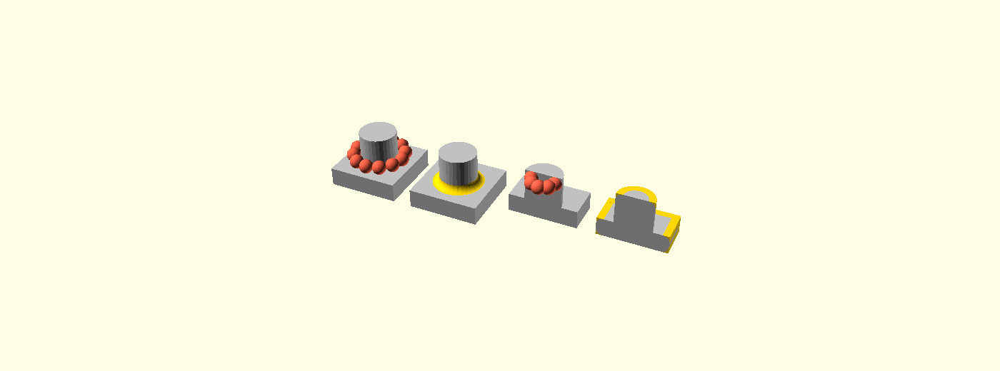

# Fillets, rounds, chamfers and bevels

*Draft PR description. This directory does not survive the merge — see
[`../README.md`](../README.md).*

Adds five modules that blend the edges of a solid without being told where those
edges are:

```openscad
fillet(r = 3) my_model();
```

| Module | Blend | Edges | Composition |
|---|---|---|---|
| `fillet_tool(r)` | round | concave | caller `union()`s the tool |
| `chamfer_tool(t)` | flat | concave | caller `union()`s the tool |
| `round_tool(r)` | round | convex | caller `difference()`s the tool |
| `bevel_tool(t)` | flat | convex | caller `difference()`s the tool |
| `fillet(r)` | round | both | the concave pass, then the convex pass over its result |

The four `*_tool` modules return a **tool solid** and modify nothing. `fillet()`
composes two of them, and is exactly this:

```openscad
module fillet(r = 2, inner = true, outer = true, min_angle = undef) {
    module blended() {
        union() {
            children();
            if (inner) fillet_tool(r = r, min_angle = min_angle) children();
        }
    }
    difference() {
        blended() children();
        if (outer) round_tool(r = r, min_angle = min_angle) blended() children();
    }
}
```

**"Then" is load-bearing.** The round pass is measured against the solid the
fillet pass left, not against the original child. Where an inner bead runs out
onto a face of the model it leaves its end cross-section standing in that face,
and a round pass that never saw the bead leaves that crescent as a sharp lip
beside the outline it just rounded.

Keeping the tools separate is what makes "chamfer outside, fillet inside, and
leave these three edges alone" expressible without new syntax.

Input is any solid: a CSG tree, an imported STL, the output of `hull()`. No edge
list is maintained by hand and nothing has to be authored specially.

---

## One straight crease

Take an L with a single concave crease running down it. `chamfer_tool(t = 4)`
lays a prism along that crease, reaching 4 mm back along each wall. That prism is
the whole tool. `fillet_tool(r = 4)` is the same prism with a cylinder of radius
4 taken out of it, on the axis one radius off each wall:


*1: `chamfer_tool(t = 4)` in gold on the model in grey. 2: the same wedge, with
the cylinder that is about to come out of it in red. 3: `fillet_tool(r = 4)`. 4:
the cross-section, lying flat — the wedge is a **pentagon**, not a triangle,
because each cell stands a hair past both walls so that it crosses the surface
instead of resting on it. That hair is `1e-3` of the size — 0.004 mm here — so it
is drawn far larger than life, and panels 1–3 show a triangle and are not wrong
to. Source: `fig-wedge.scad`.*

Where a blend stops and flat wall starts is decided by a ball of the requested
radius: seat it in the crease so it touches both walls, and the two points it
touches at are where the tool's cross-section ends. Everything below is that same
ball, in the places where it is not simply a cylinder.

## Corners

Where three walls meet, the ball has nowhere to roll. It seats once, against all
three at the same time, and the corner of the tool is the piece the three beads
leave for it:


*1: an inside corner with the ball seated against all three walls. 2:
`fillet_tool(r = 4)` on it — three beads and the corner cell between them. 3: the
outside corner of a cube with its tip sliced off square to the body diagonal and
the ball left whole, because at a convex corner the ball sits inside the
material. 4: the whole `round_tool(r = 4)` for that cube — twelve beads and eight
corner cells in one connected piece — with the far corner left solid and the rest
dropped to alpha, so what shows is the cell's inner face. Source:
`fig-corner.scad`.*

The concave and convex cases are one construction with a sign flipped: the ball's
centre goes into the empty quadrant for a fillet and into the material for a
round, and the tool is the material on the other side of it either way.

## A crease with many edges in it

A crease that curves is a run of edges rather than one, and each end of each edge
is a **station** with its own seated ball. Consecutive balls are hulled into a
cell, and the cells unioned:



*Left pair: the foot of a boss — a concave crease right round the cylinder — with
a ball drawn at twelve stations, and `fillet_tool(r = 3)` on the same model. Right
pair: the convex crease at the top rim, the model cut in half so the balls that
sit inside the material can be seen, and `round_tool(r = 3)` on the same cut.
Source: `fig-hull.scad`.*

So the tool is never one long prism except in the straight case. Each station
gets its **own** cross-section, built from that station's own two wall normals —
which is what lets both walls curve independently, as they do where two pipes
cross. Consecutive cross-sections are hulled into one cell per segment, and the
cells are unioned:

```
station i      station i+1     station i+2
   ▢───────────────▢───────────────▢        cross-sections, one per station
   └── hull ───────┘└── hull ──────┘        one cell per segment, then union
```

Hulling two sections *is* the linear interpolation between them, which is why a
brush that stops partway along a segment can be honoured exactly: interpolate the
section to that parameter and hull to there.

The subtracted ball follows the same treatment — an arc section per station,
hulled pairwise — so on a straight crease the two hulls give back a cylinder, and
on a curved one they give a canal that bends with it. A cylinder meeting a plane,
a spine that turns a corner and an imported mesh all arrive at this same loop.

---

## How it works

Everything happens on the target's triangle soup, so a cylinder meeting a plane
goes through the same code as an imported mesh.

**1. Classify.** Merge coincident vertices, rebuild edge → two-face adjacency,
give every two-face edge a dihedral angle and a sign. An edge is a **feature**
when it turns by more than a threshold, and tessellation otherwise.

The threshold is derived rather than fixed: **1.5 × the caller's own facet
angle**. An edge is a feature of the shape when it turns more sharply than the
tessellation's own facets do, which is what lets a cylinder keep smooth sides at
any `$fn` while a real 90° corner is found on any model. `min_angle=` overrides
it.


*`debug = true` emits the classifier's verdict instead of the tool: red concave
feature, green convex feature, grey rejected seam, with the ball centre and both
tangency points drawn for the creases this tool selected.*

**2. Walk into chains.** Selected edges are walked into open arcs and closed
rings. A chain is the unit everything downstream works on; a vertex where three
or more selected creases meet is a **junction**.

**3. Frame each station.** At every vertex along a chain, seat the ball as above.
That gives the centre `C` and the two tangency points `TA`, `TB` where the blend
stops being a blend and becomes flat wall again.

**4. Check the size fits**, per crease rather than per model — see below.

**5. Build the tool.** One cross-section per station, hulled with its neighbour
into a cell per spine segment, unioned; for the rounded tools the ball's own
sections are hulled the same way and subtracted in a single boolean.

**6. Close the junctions.** Where three or more creases meet, each incident bead
stops short of the vertex and a **corner cell** fills what they vacated, hulled
from the ball seated at the junction and the sections the beads stop at. A
trihedral corner blend has no closed form at equal radius, so the junction is
solved for a centre tangent to every incident wall; at valence four and above,
several distinct centres can satisfy that, and the solve picks among them.

A selection brush is honoured where it lies: a bead is cut square where the brush
boundary crosses a crease, and a corner cell is built only where the brush covers
the radius down every crease meeting there.

### Does the size fit?

Two questions are asked along each chain, sampled by length rather than only at
mesh vertices, because on a tapering feature the room runs out *between* two
vertices:

- **Does the blend still meet the model?** `TA` and `TB` have to land in the
  interior of the walls they are meant to blend, not past their ends. A radius of
  35 has nowhere to sit on a 30 mm face.
- **Is the material it needs its own?** Whether another crease's blend reaches
  into the corner this one occupies.

A crease that fails either is **dropped with a warning naming the point and the
reason**. The size is never clamped to make it fit, and the rest of the model is
unaffected.

### Which wall — `smoothSurfaces`

Both questions are asked of *walls*, and a wall is not a triangle. This grouping
is the size check's business only — the tool itself is built per station, from
that station's own two normals — but the check has to know where a wall ends.

`smoothSurfaces` groups triangles into surfaces by union-find, joining across
every edge that is **not** a crease. All 48 facets of a bore come back as one
wall; a cube's face is another.

Without that grouping, "the wall" would be the one triangle the station named,
and the contact point almost never lands on it: the tangency sits a radius away
from the crease, which on any tessellated wall is a triangle or two along. Every
fillet at the foot of a bore would be refused for running off a wall it had not
actually left. Grouped, the contact point walks the facets freely and leaves the
wall only where the wall genuinely ends — at a crease, which is the same question
the classifier already answers. That is what also makes the check mean something
in the other direction: the surface's rim is where the model really stops, so
`r = 35` on a 30 mm arm is still caught.

The walk is bounded to the surface the station named and to the distance the
seated ball can reach, which matters on a model that has already been blended:
a bead is tangent to its walls, so the smooth grouping runs straight through it
and a rib, its two beads and the plate would otherwise come back as one surface.

### Overshoot

Each piece of the tool stands slightly past the wall it has to cut through, on a
ladder: wedge cells `eps`, corner cells `1.5 eps`, the subtracted arc `2 eps`.
This is not cosmetic. When two surfaces meet *along* a face rather than crossing
it, the triangles left behind enclose no area, and CGAL refuses to convert such a
mesh at all. The ladder guarantees every cut crosses transversally. The arc's
share is two extra hull points per section, in the tangency directions, so the
blend still meets each wall exactly where a ball of radius `r` touches it.

---

## Testing

| Where | What |
|---|---|
| `FilletBuilder_test.cc` | 54 cases, 535 assertions — classification, chains, frames, brushes, the size gate, junctions, turns, runout, debug markers |
| `FilletCompare_test.cc` | 16 cases, 63 assertions — exact comparison against hand-written reference solids |
| `tests/data/scad/3D/features/` | 5 regression models with committed baselines across preview, render, render-cgal, render-manifold, throwntogether and the `.csg` dump |

The comparison tests are the interesting half. Where a blend has a closed form,
the result is compared against it exactly — the hole mouth against an annulus
prism minus a torus, a cube corner against the true rounded solid. Where it has
none, it is compared against a shrink-and-grow reference, calibrated by two
self-tests that pin it between always-pass and always-fail.


*Left: a three-face pocket, cut open — three concave walls meeting at an apex,
which has no closed-form equal-radius blend. Middle: a sheared five-sided pyramid
— an asymmetric high-valence corner. Right: a rib on a plate, where two concave
creases and one convex one meet at a vertex.*

### Known red

Two prototyping-bench cases — the three- and four-face pockets — fail the bench's
dilation check, which needs CGAL to convert the mesh to a Nef polyhedron. That
conversion now succeeds; the refusal has moved into CGAL's convex decomposition,
on a mesh whose smallest triangle is `8.1e-07` and which Manifold reports as a
clean solid of the expected genus. Both pockets are pinned exactly by
`FilletCompare_test.cc`, which does not go near CGAL.

Several other bench cases are red because the check asks that the result stay
within the tool's own size of the model, and rounding a sharp apex moves the
surface by more than the radius — that is the check failing to express the
answer, not the answer being wrong.

Re-reading a rounded cube back in still classifies 360 features, 216 of them
spurious, on a solid that has none. That is the tangential-contact sliver problem
the *Re-filleting* caveat is about; `FilletBuilder_test.cc` carries it as a bound.

---

## Not built

- **Runout, variable radius along a chain, unequal radii at a vertex.** A tool
  node carries one size for the whole invocation.
- **Re-fillet tagging** (stamping originating IDs through MeshGL). The angle
  threshold plus `min_angle=` is the protection; that re-filleting does not crash
  is pinned by a test.
- **Analytic fast paths** (exact torus for plane-meets-cylinder). Optional speed
  work, to be taken only if profiling demands it.

## Reviewing this

- `src/core/FilletNode.{h,cc}` — the five nodes and their parameters
- `src/geometry/GeometryEvaluator.cc` — brush collection and the two-tool
  composition for `fillet()`
- `src/geometry/fillet/FilletBuilder.cc` — the pipeline above, in the order
  described
- `src/geometry/fillet/FilletBrush.{h,cc}` — the brush AABB tree
- `src/geometry/fillet/FilletBuilder_internal.h` — the types, and the best entry
  point for reading the rest

The two test files are worth reading before the builder: they state what each
stage is supposed to produce.
