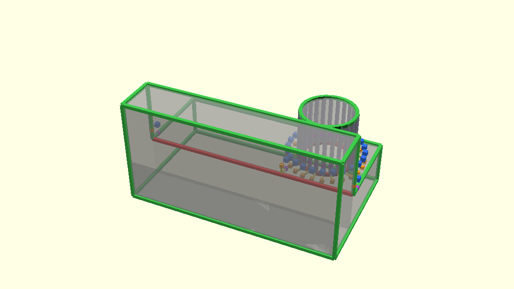
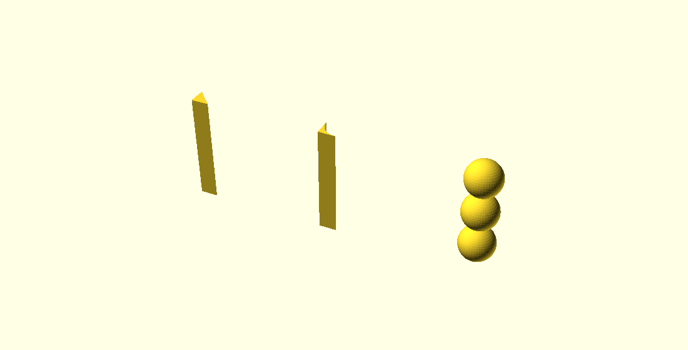
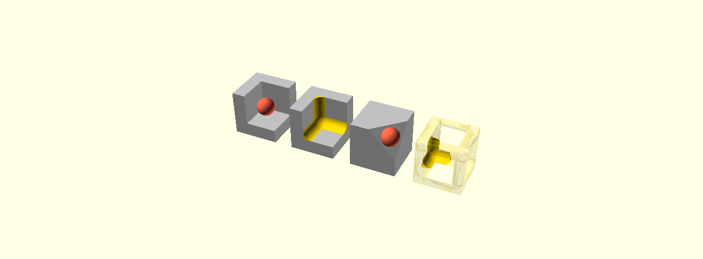
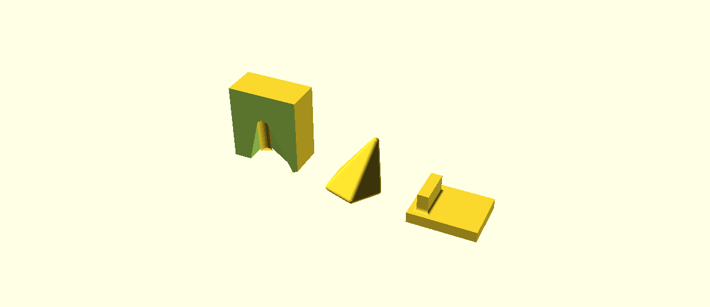

# Fillets, rounds, chamfers and bevels

*Draft PR description. This directory does not survive the merge — see
[`../README.md`](../README.md).*

Adds five modules that blend the edges of a solid without being told where those
edges are:

```openscad
fillet(r = 3) my_model();
```

| Module | Blend | Edges | Composition |
|---|---|---|---|
| `fillet_tool(r)` | round | concave | caller `union()`s the tool |
| `chamfer_tool(t)` | flat | concave | caller `union()`s the tool |
| `round_tool(r)` | round | convex | caller `difference()`s the tool |
| `bevel_tool(t)` | flat | convex | caller `difference()`s the tool |
| `fillet(r)` | round | both | `difference(union(child, fillet_tool), round_tool)` |

The four `*_tool` modules return a **tool solid** and modify nothing. `fillet()`
is sugar over composing two of them, written out as a comment above the node so
anyone wanting a different composition can start from it. The tools are the
composable surface; keeping them separate is what makes "chamfer outside, fillet
inside, and leave these three edges alone" expressible without new syntax.

Input is any solid: a CSG tree, an imported STL, the output of `hull()`. No edge
list is maintained by hand and nothing has to be authored specially.

---

## How it works

Everything happens on the target's triangle soup. There is no node-tree
pattern-matching and no analytic special case — a cylinder meeting a plane goes
through the same code as an imported mesh.

### 1. Classify

Merge coincident vertices, rebuild edge → two-face adjacency, and give every
two-face edge a dihedral angle and a sign. An edge is a **feature** when it turns
by more than a threshold, and a **seam** otherwise.

The threshold is derived rather than fixed: **1.5 × the caller's own facet
angle**. An edge is a feature of the shape when it turns more sharply than the
tessellation's own facets do, which is what lets a cylinder keep smooth sides at
any `$fn` while a real 90° corner is found on any model. `min_angle=` overrides
it. Exact ties are rejected rather than accepted — a model tessellated at two
thirds the caller's `$fn` turns by *exactly* the threshold, and float noise there
would otherwise split edges that are identical by symmetry.



*`debug = true` emits the classifier's verdict instead of the tool: red concave
feature, green convex feature, grey rejected seam, with the per-station ball
centre and both tangency points drawn for the creases this tool selected.*

### 2. Walk into chains

Selected edges are walked into chains — open arcs and closed rings. A chain is
the unit everything downstream works on, and a vertex where three or more
selected creases meet is a **junction**.

### 3. Frame each station

At every vertex along a chain, seat a ball of the requested radius into the
corner so it touches both walls. That gives the ball centre `C` and the two
tangency points `TA`, `TB` where the finished blend stops being a blend and
becomes flat wall again. A chamfer's setback is the same construction with the
arc replaced by a straight cut.

### 4. Check the size fits — per crease, not per model

Two questions are asked along each chain, sampled by length rather than only at
mesh vertices, because on a tapering feature the room runs out *between* two
vertices:

- **Does the blend still meet the model?** `TA` and `TB` are taken as the
  *nearest points on their walls* to the ball centre, so they lie on the wall by
  construction; the question is then whether that point is in the wall's interior
  or on its boundary. Stepping off the centre along an averaged normal instead —
  which is what this used to do — assumes the wall is flat, and refused perfectly
  good blends on a dome by the sagitta `r²/2R`.
- **Is the material it needs its own?** Whether another crease's blend reaches
  into the corner this one occupies. Asked of the corner rather than of the seated
  ball, because the ball is a full sphere reaching `r` *along* each wall past its
  own tangency line, into material the finished blend never touches — asking about
  it refused every radius past a third of a cube's side, where the geometry runs
  out at half.

A crease that fails either is **dropped with a warning naming the point and the
reason**. The size is never clamped to make it fit, and the rest of the model is
unaffected.

### 5. Build the tool

Per spine segment, a prism cell whose faces are set back along each wall. For the
rounded tools, the swept ball is then subtracted from the wedge in one boolean,
which leaves a surface tangent to both walls.



*Left: `chamfer_tool` — the wedge. Middle: `fillet_tool` — the same wedge with
the rolling ball taken back out. Right: the ball, seated at three stations.*

### 6. Close the junctions

Where three or more creases meet, each incident bead is truncated short of the
vertex and a **corner cell** fills what they vacated, hulled from the ball seated
at the junction and the sections the beads stop at. A trihedral corner blend has
no closed form at equal radius, so this is solved rather than looked up: the
constraint is a ball tangent to all incident walls, and at valence four and above
several distinct centres can be feasible.



*Left: the tool for a cube — twelve beads and eight corner cells. Right: the same
tool subtracted from it.*

A selection brush is honoured where it lies: a bead is cut square where the brush
boundary crosses a crease, and a corner cell — which is the full seated ball
whatever is selected, and cannot be clipped against three perpendiculars at once —
is built only where the brush covers the radius down every crease meeting there.

Junctions the solve refuses — a needle whose apex half-angle puts the seated ball
far down the axis — get no corner, and the incident blends fade out to the vertex
rather than ending in a cliff.

### 7. Overshoot

Each piece of the tool stands slightly past the wall it has to cut through, on a
ladder: wedge cells `eps`, corner cells `1.5 eps`, and the subtracted arc
`2 eps`. This is not cosmetic. When two surfaces meet *along* a face rather than
crossing it, the triangles left behind enclose no area, and CGAL refuses to
convert such a mesh at all. The ladder guarantees every cut crosses transversally.
The arc's share is two extra hull points per section, in the tangency directions,
so the blend still meets each wall exactly where a ball of radius `r` touches it.

Two consequences of the ladder are worth knowing, because both were bugs before
they were rules:

- **The corner cell may not be built from the bead's own cross-section.** It used
  to be, and a section of a chain is by construction where that chain's cells
  end — so the two solids touched along a whole shared face before separating, at
  whatever angle their faces made, which on a spike is a fraction of a degree.
  The profile is now rebuilt from the same three points at the corner cell's own
  distance past the walls, so the surfaces sit half an `eps` apart and cross
  transversally. Smallest triangle on the three-face pocket: `2.4e-13` before,
  `8.1e-07` after.
- **At a corner the cutter is a ball, and a tessellated ball is short.** Drawn as
  an inscribed polyhedron it reaches its faces' distance from the centre, not
  `r` — 0.034 short at `$fn = 24` on `r = 2`, 0.0086 at 48. The point that stands
  past a wall has to clear that shortfall first, measured off the ball's own mesh
  rather than assumed from the segment count, or the corner sheds the overshoot
  it cannot reach. That is what made a wafer appear at `$fn = 48` and not at 24.

---

## Testing

| Where | What |
|---|---|
| `FilletBuilder_test.cc` | 54 cases, 535 assertions — classification, chains, frames, brushes, the size gate, junctions, turns, runout, debug markers |
| `FilletCompare_test.cc` | 16 cases, 63 assertions — exact comparison against hand-written reference solids |
| `tests/data/scad/3D/features/` | 5 regression models with committed baselines across preview, render, render-cgal, render-manifold, throwntogether and the `.csg` dump |

The comparison tests are the interesting half. Where a blend has a closed form,
the result is compared against it exactly — the hole mouth against an annulus
prism minus a torus, the inner corner against a hand-written bead, a cube corner
against the true rounded solid. Where it has none — a trihedral pocket, an
asymmetric valence-5 apex — it is compared against a shrink-and-grow reference,
and the comparison is calibrated by two self-tests that pin it between
always-pass and always-fail.



*Left: a three-face pocket, cut open — an apex where three concave walls meet,
which has no closed-form equal-radius blend. Middle: a sheared five-sided pyramid,
an asymmetric high-valence corner, where the junction yields several distinct
seated balls rather than the single one a symmetric cone collapses to. Right: a
rib on a plate, where two concave creases and one convex one meet at a vertex, so
whichever tool runs hears about only some of the walls bounding its corner.*

---

## What is still red, and why it is not the operator

Two harness cases — the three-face and four-face pockets — still fail the
prototyping bench's dilation check. The check works by growing the result with a
Minkowski sum and asking that the blended solid stay inside it, so it needs CGAL
to convert the mesh to a Nef polyhedron.

**That conversion now succeeds.** It used to throw, and the two defects behind it
are fixed (both are described under *Overshoot* above). The refusal has moved
downstream into CGAL's convex decomposition, which reports two facets sharing a
halfedge on a mesh whose smallest triangle is `8.1e-07` and which Manifold
reports as a clean solid of the expected genus. Nothing measured says that one
belongs to these operators, and the correctness of both pockets is pinned exactly
elsewhere — `FilletCompare_test.cc` compares each against a shrink-and-grow
reference without going near CGAL.

Several other bench cases are red for a reason the bench itself documents: the
check asks that the result stay within the tool's own size of the model, and
rounding a sharp apex moves the surface by far more than the radius — a ball of 6
seated in a 30 × 60 cone tops out 18.7 below the tip. That is the check failing
to express the answer, not the answer being wrong.

One re-read measurement is worth stating plainly because it bounds a documented
caveat rather than a bug: a rounded cube read back in still classifies 360
features, 216 of them spurious concave ones, on a solid that has none. That is
the tangential-contact sliver problem the *Re-filleting* caveat is about. It has
improved twice with the mesh fixes — 650 → 480 → 360 — and the shortest edge a
spurious crease sits on has gone `6.6e-4` → `5.6e-3` on a 40 mm part.
`FilletBuilder_test.cc` carries that as a bound.

---

## Deliberate non-goals

Each of these was considered and rejected with a reason, not left undone:

- **Re-fillet tagging** (reserved ID ranges, stamping originating IDs through
  MeshGL). The angle threshold plus `min_angle=` is the protection; the
  requirement is that re-filleting does not crash, which is pinned by a test. The
  tagging machinery was the riskiest thing in the design and buys a rule nobody
  asked for.
- **Analytic fast paths** (exact torus for plane-meets-cylinder). Optional speed
  work, to be taken only if profiling demands it. Nothing has.
- **A second classifier filter on triangle quality or area.** Measured, and the
  two populations are *inverted*: a real crease running against a bead has worse
  triangles at the median than the noise does, so every threshold takes the
  feature first.
- **Runout, variable radius along a chain, unequal radii at a vertex.** A tool
  node carries one size for the whole invocation.

## Reviewing this

- `src/core/FilletNode.{h,cc}` — the five nodes and their parameters
- `src/geometry/GeometryEvaluator.cc` — brush collection and the two-tool
  composition for `fillet()`
- `src/geometry/fillet/FilletBuilder.cc` — the pipeline above, in the order
  described
- `src/geometry/fillet/FilletBrush.{h,cc}` — the brush AABB tree
- `src/geometry/fillet/FilletBuilder_internal.h` — the types, and the best entry
  point for reading the rest

The two test files are worth reading before the builder: they state what each
stage is supposed to produce.
