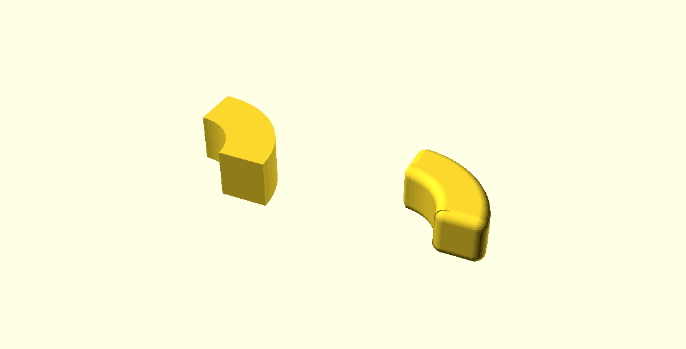
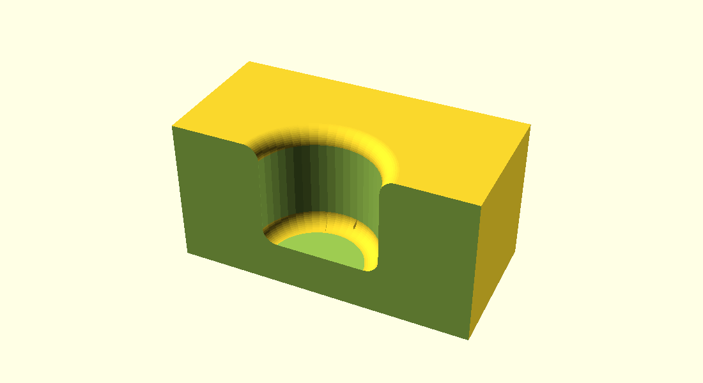
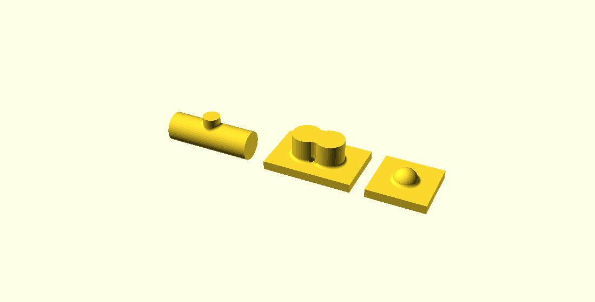

# Fillets, rounds, chamfers and bevels

*Draft for the public OpenSCAD wiki. This directory does not survive the PR
merge; the text is meant to be pasted into the wiki, and the images uploaded
alongside it.*

These operators take a solid, find its edges themselves, and round or cut them
back.

```openscad
fillet(r = 3) my_model();
```



*Left: the model as written. Right: the same model wrapped in `fillet()`.*

It works on anything that is a solid — a CSG tree, an imported STL, the result
of a `hull()`.

## The five modules

`fillet()` is sugar. Underneath are four modules that each build a **tool
solid** — the material a blend adds or removes — which you compose yourself:

| Module | Blend | Edges it follows | How you use it |
|---|---|---|---|
| `fillet_tool(r)` | round | concave (inner) | `union()` it in |
| `chamfer_tool(t)` | flat | concave (inner) | `union()` it in |
| `round_tool(r)` | round | convex (outer) | `difference()` it out |
| `bevel_tool(t)` | flat | convex (outer) | `difference()` it out |

and `fillet(r)` runs both, in that order: it unions the fillet tool into the
model, then rounds the solid that produced.

```openscad
module fillet(r = 2, inner = true, outer = true, min_angle = undef) {
    module blended() {
        union() {
            children();
            if (inner) fillet_tool(r = r, min_angle = min_angle) children();
        }
    }
    difference() {
        blended() children();
        if (outer) round_tool(r = r, min_angle = min_angle) blended() children();
    }
}
```

The round pass reads what the fillet pass left, so where an inner blend runs out
onto a face, the outline it leaves there is rounded along with the rest.

Write your own version when you want a different composition — a chamfer outside
and a fillet inside, say, or two different sizes.

## What a tool solid is

Nothing exotic. Take an L with one straight inside corner. The chamfer along it
is a prism laid down the corner: one point `t` along each wall, joined across.
The fillet is that same prism with a cylinder of radius `r` taken out of it —
the path a ball of that radius takes when it rolls down the corner touching both
walls.


*Left to right: the prism, which is `chamfer_tool(t = 4)`; the same prism with
the cylinder that comes out of it in red; what `fillet_tool(r = 4)` gives you;
and the cross-section lying flat. The prism reaches a hair into the walls, so a
tool crosses the surface it cuts rather than resting on it — drawn far larger
than life in the last panel, being 0.004 mm at this size.*

Everything else the operators do is that idea generalised: the corner bends, the
walls curve, the angle between them changes along the way, and several corners
meet at a point — where the rolling ball has nowhere to roll and simply sits,
touching all three walls.

## Choosing edges

Two things decide whether an edge is treated.

**Its sign.** A concave edge is an inside corner, where material meets material;
a convex edge is an outside corner. `fillet_tool` and `chamfer_tool` follow the
concave ones, `round_tool` and `bevel_tool` the convex ones.

**How sharply it turns.** An edge counts as a feature of the shape when it turns
by more than 1.5× the facet angle *you* are working at — 22.5° at `$fn = 24`.
Below that it is read as tessellation and left alone, which is what keeps a
cylinder's sides smooth while its rims get rounded. `min_angle = <degrees>`
overrides this when it picks the wrong edges.

## Picking particular edges: brushes

Children after the first are **selection brushes**. A brush is an ordinary
solid, and the tool acts only where a crease lies inside it.



*A block with a blind bore, near half cut away. The bore floor is filleted, the
bore mouth is rounded, and the block's own corners are left sharp — a brush over
the mouth is what separates it from the block's corners, which are convex too.*

```openscad
module part() {
    difference() {
        cube([40, 40, 20]);
        translate([20, 20, 6]) cylinder(r = 8, h = 20, $fn = 48);
    }
}

difference() {
    union() {
        part();
        fillet_tool(r = 2) part();          // the bore floor - no brush needed,
    }                                       // it is the only concave crease
    round_tool(r = 2) {
        part();
        translate([20, 20, 14]) cylinder(r = 14, h = 8);    // brush: the mouth
    }
}
```

Two things to know about brushes:

- **A brush chooses which stretches get built.** The blend is the full size you
  asked for wherever it is built, however small the brush is.
- **A blend stops square.** Where the brush boundary crosses an edge, the blend
  ends in a flat cap.

## Curved edges

The edge a blend follows does not have to be straight, and the surfaces it
blends do not have to be flat.



*Left: a weld fillet where a branch pipe lands on a run pipe — the seam between
two cylinders, whose angle changes at every point along it. Middle: two
overlapping bosses, whose base rings cross each other at two points. Right: a
dome, a wall curved in both directions at once.*

## When something does not fit

A size is never quietly reduced. If a blend of the size you asked for cannot be
built along an edge, that edge is left alone and you are told which one:

```
WARNING: fillet_tool: radius 2 does not fit the crease at [12, -12, 2] -
         another feature 1.69 away needs the same material. That crease is
         dropped; the size is never clamped to make it fit.
```

Every other edge on the model is still blended. A size fails to fit when the
blend would run off the end of a face it is meant to meet, or when a second
feature nearby needs the same material.

## Things to know

- **Preview shows the model unblended.** `fillet()` hands back its child
  untouched under F5, because the blends cost real work on every keystroke.
  Press F6, or pass `disable_preview = false`. The four `*_tool` modules always
  build.
- **One size per call.** Variable radius along an edge, and different radii
  meeting at a corner, are not supported.
- **Blend the source model, not a blended result.** A finished blend meets its
  wall tangentially, and a tessellated tangency produces slivers that read back
  as edges the shape does not have.
